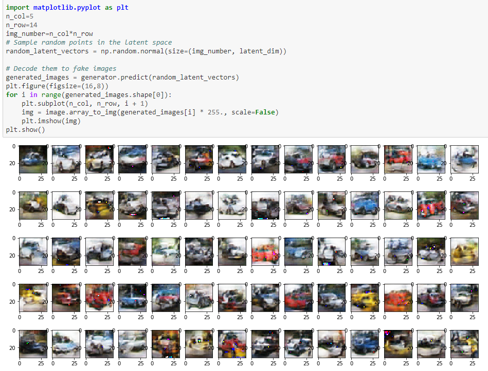

# CS8321: Neural Networks and Machine Learning
### Xingming Qu

## Lab 1 - CNN Visualization
In this lab you will implement the DeepDream architecture for a neural network.

## Lab 2 - Style Transfer
In this lab you will implement a photo realistic style transfer algorithm, using the work of Li et al. in their universal style transfer paper. An implementation of training a decoder for different scales of VGG has already been implemented for you (https://github.com/8000net/universal-style-transfer-keras (Links to an external site.)). For photo realistic transfer, you will be implementing the smoothing constraint from Li et al. discussed in lecture, as well as adding un-pooling layers to the implementation. 

## Lab 3 - Multi-modal and Multi-task
In this lab, you will implement a multi-task network (possibly multi-modal) that classifies interactions between compounds and ligands in the ChEMBL database (https://www.ebi.ac.uk/chembl/ (Links to an external site.)). The objective is to classify which ligands bind to which targets. Each target will be a separate task working from a  shared ligand representation. 

## Lab 4 - GAN Example Fixing
In this lab you will improve upon the methods employed by Chollet in his example from the book: https://github.com/fchollet/deep-learning-with-python-notebooks/blob/master/8.5-introduction-to-gans.ipynb

## Final Project - An investigation of StarCraft II Learning Environment
For the final class paper, I investigate one of the topic from the course, which is Reinforcement Learning.
This paper investigates the StarCraft II Learning Environment SC2LE and improves an existing reinforcement learning methods for StarCraft II mini game by implement epsilon-greedy strategy. Experimental results show that our agent could achieve almost the same performance as the one we investigated but ues less training time.

Video: https://drive.google.com/drive/folders/1WAldx-tjhxpSG5h52BMWy4_av4QRt93o?usp=sharing

